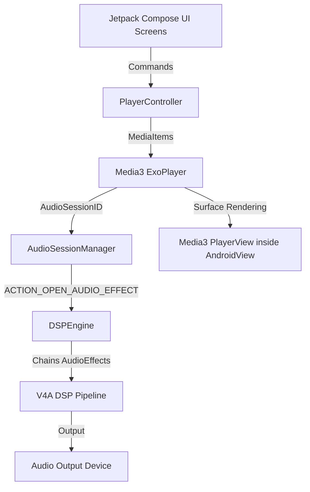

# DeepEye Music Pro — Unified Media3 System Architecture (STAGE 1)

This document describes the unified media playback pipeline, Hilt dependency mapping, and audio effect routing architecture of DeepEye Music Pro.

---

## 1. High-Level Core Design

DeepEye Music Pro is designed around a **Single Playback Engine** architecture. Both local audio files and remote YouTube video streams are routed natively through a single Media3 `ExoPlayer` instance, eliminating secondary web views, proxy servers, or duplicate playback controllers.

---

## 2. Key Architecture Components

### Playback Control Layer
* **PlayerController**: The single source of truth for the playback states. It exposes properties as read-only `StateFlow<PlayerState>` to UI screens. It handles queue advancing, track skips, sleep timers, SponsorBlock auto-skipping, and histories.
* **QueueManager**: Holds the reactive queue items (`List<MediaItem>`) and handles shuffling, repeating, and indexing updates.
* **SourceResolverManager**: Fetches direct playable streaming URLs for remote video media. If the high-speed extraction API fails, it automatically falls back to DASH/HLS stream selectors.

### Background Playback & Media Session
* **MusicPlayerService**: A `MediaSessionService` that manages background playback, handles audio focus changes, and registers the foreground service.
* **ForwardingPlayer**: Wraps the raw `ExoPlayer` instance, delegating seek operations (`seekToNext`, `seekToPrevious`) to the `PlayerController` to support custom playlist queuing, while leaving all state tracking and playback states to native ExoPlayer hooks.
* **NowPlayingGuardian**: A diagnostic helper running on a 4-second loop that verifies whether the UI, ExoPlayer, and MediaSession metadata are synchronized, triggering auto-repair if any layer falls out of sync.

### Audio Effects & DSP Pipeline
* **AudioSessionManager**: Monitors audio session ID changes. Broadcasts standard Android system intents to bind global equalizer effects and routes state to the DSP engine.
* **DSPEngine**: Configures and chains Android native audio effects (`Equalizer`, `BassBoost`, `Virtualizer`, `PresetReverb`, `LoudnessEnhancer`, and `DynamicsProcessing`) to match premium V4A profiles.
* **AudioRouteReceiver**: Detects system device transitions (Bluetooth, Headset, Speaker, USB DAC) and triggers preset changes.
