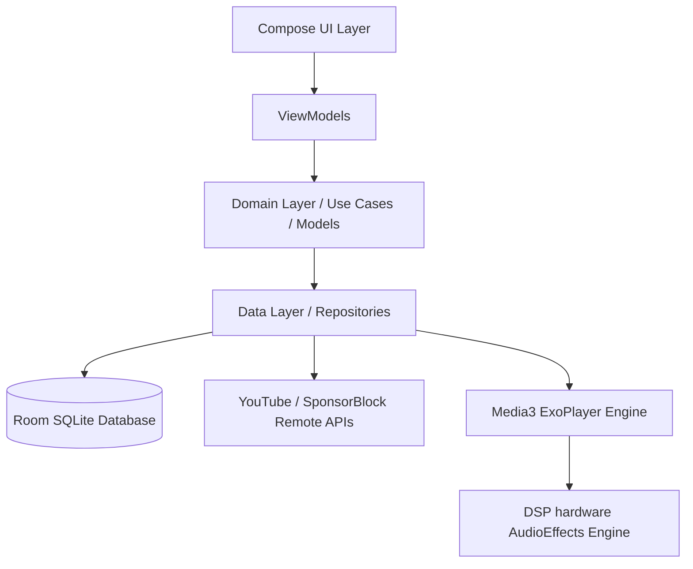
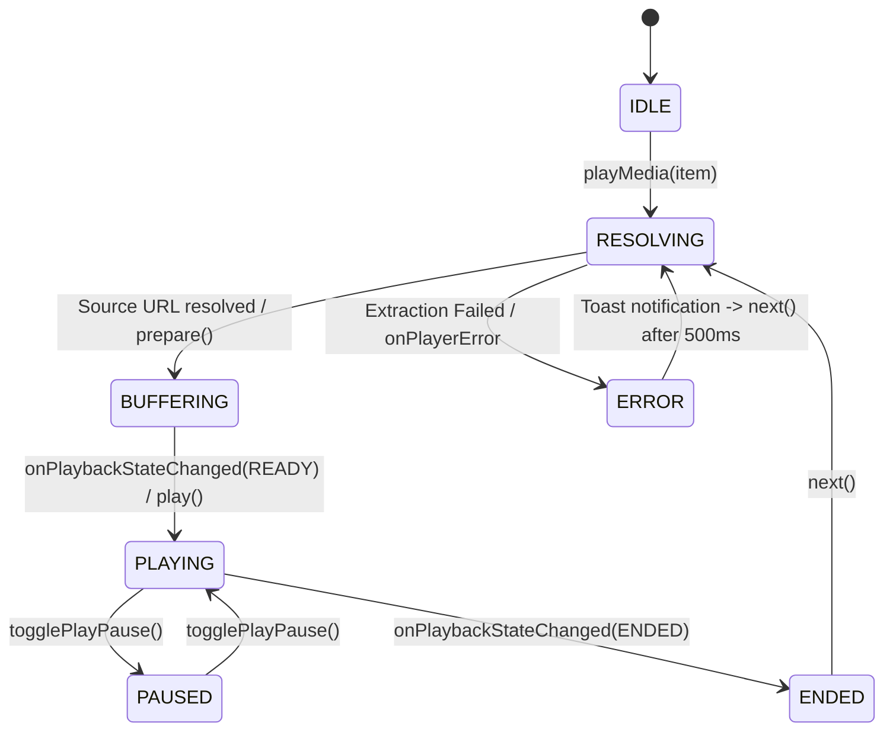
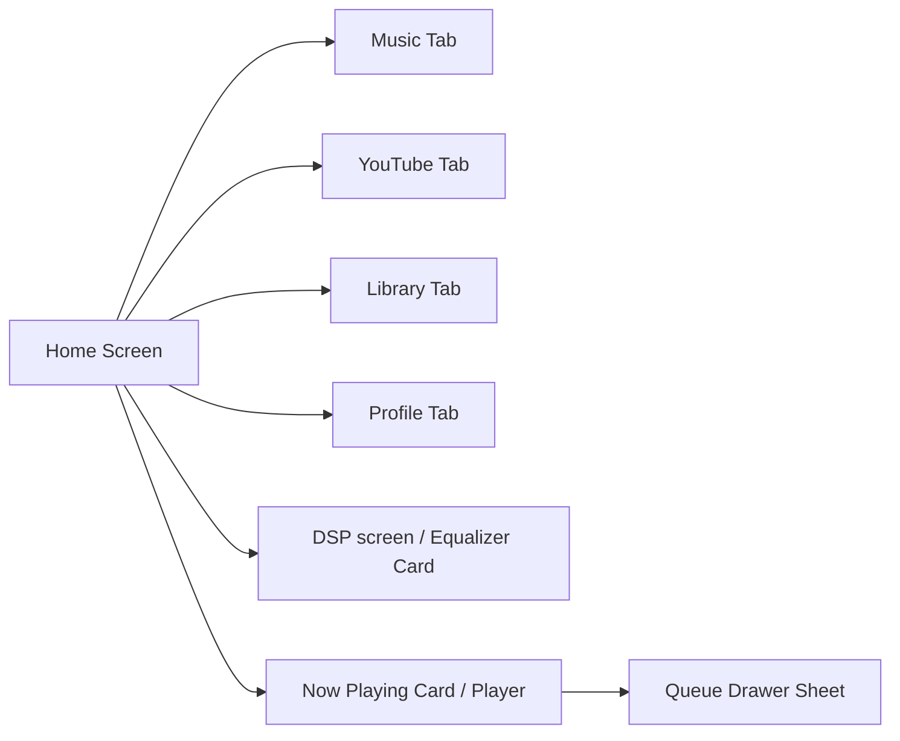

# DeepEye Music Pro — Full Project Audit Report (PROJECT_AUDIT.md)

This document represents the full architectural, system, and quality audit of the DeepEye Music Pro codebase. It maps out subsystems, dependency relationships, playback routes, risk matrices, and crash maps.

---

## 1. System Architecture Map

The project conforms to a Clean Architecture style with Hilt-driven dependency injection:



---

## 2. Dependency Graph (Modules & Libraries)

```
app (com.deepeye.musicpro)
  ├── androidx.compose (UI Layer)
  ├── androidx.media3 (ExoPlayer, MediaSession, Notification Engine)
  ├── dagger.hilt (Dependency Injection Framework)
  ├── androidx.room (Persistence Layer)
  ├── kotlinx.coroutines & Flow (Concurrency & State streaming)
  └── gson (JSON serialization layer)
```

---

## 3. Playback State & Runtime Graph

This diagram logs the lifecycle transitions of playback states inside `PlayerController` and the ExoPlayer engine:



---

## 4. UI Navigation Graph

This diagram charts tab switching and screen expansions:



---

## 5. Risk Map & Crash Resolution Log

| Subsystem | Risk Description | Severity | Mitigation / Resolution |
| :--- | :--- | :---: | :--- |
| **Playback** | Network drops or source extraction failures could cause crashes. | `High` | Added safety try-catch block inside `PlayerController.onPlayerError` that toast-notifies the user and skips to next track. |
| **DSP Engine** | Leaking Android hardware audio effects slot allocations on transition errors. | `High` | `DSPEngine.kt` implements an outer catch block calling `releaseSession()` to release partially allocated effects slots. |
| **State Sync**| UI progress and control keys desyncing from lockscreen MediaSession notifications. | `Medium`| Unified all controllers under native Media3 `MediaSession` connected directly to the singleton player instance. |
| **History DB**| SQLite lockups and thread blocks during queue snapshot serialization. | `Medium`| Implemented a 1-second debounce (`queueManager.queue.debounce(1000L)`) in `PlayerController` for queue snapshotting. |
