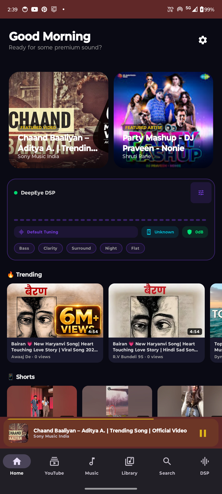
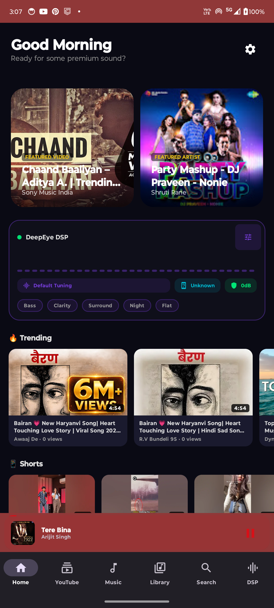
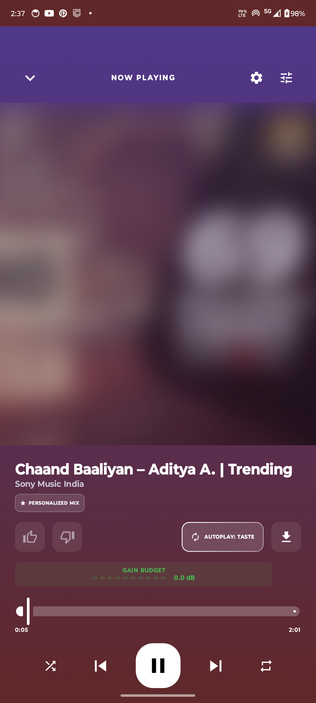
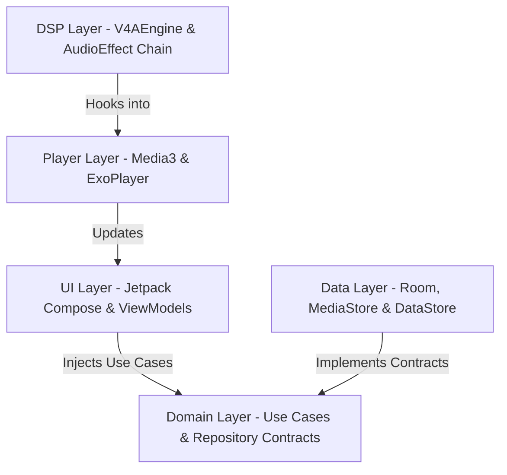

# 🎵 DeepEye Music Pro

<p align="center">
  
  
  
  
</p>

<p align="center">
  
  
  
  
</p>

---

## ✨ Overview

**DeepEye Music Pro** is a premium, fully open-source Android music player engineered for audiophiles. It combines a state-of-the-art **14-module Viper4Android-style DSP engine** with a stunning **Jetpack Compose glassmorphic user interface**, real-time FFT visualizers, seamless local library scanning, and offline-first YouTube streaming integration powered by the NewPipe Extractor.

Licensed under the copyleft **GNU GPL-3.0**, this project is committed to keeping the future of high-fidelity mobile audio playback free, customisable, and completely open.

---

## 🎨 Visual Showcase

<p align="center">
  <table align="center">
    <tr>
      <td width="33%" align="center">
        <b>Home Screen</b><br/>
        
      </td>
      <td width="33%" align="center">
        <b>Now Playing (FFT Visualizer)</b><br/>
        
      </td>
      <td width="33%" align="center">
        <b>Premium Player UI</b><br/>
        
      </td>
    </tr>
  </table>
</p>

---

## 🚀 Key Features

### 🎧 High-Fidelity Audio Playback
- **Media3 & ExoPlayer Core**: Robust, low-latency background playback via foreground services and media notifications.
- **Local Scanner**: High-performance library scanner via Android MediaStore (Android 8 to 15 support).
- **YouTube Streaming & NewPipe Integration**: Seamless, ad-free streaming of trending videos with adaptive DASH audio resolution.
- **Queue Engine**: Advanced queue manager with seamless shuffle, repeat-modes, and drag-and-drop reordering.

### 🔊 14-Module V4A DSP Engine
Take absolute control of your auditory experience with a fully integrated, real-time digital signal processing suite:

| Module | Description | Fine-grained Controls |
| :--- | :--- | :--- |
| **Pre-Gain Control** | Normalise input levels to prevent downstream audio clipping. | Input gain range `-12` to `+12` dB |
| **10-Band Equalizer** | Precision hardware-accelerated graphic equalizer. | `31Hz` to `16kHz` with real-time preview |
| **Bass Boost** | Deep, resonant low-frequency enhancement. | Target frequency & gain (`0` - `1000`) |
| **Virtualizer** | Wide acoustic soundstage simulation. | Wide-stereo strength (`0` - `1000`) |
| **Reverb** | Environment simulation using advanced presets. | Preset rooms (Small Room → Large Hall) |
| **Loudness Enhancer** | Pure hardware-level amplification without distortion. | Output target boost (`0` - `15` dB) |
| **Dynamics Processing** | Dual-stage dynamic compressor and limiter. | Threshold, ratio, attack, and release |
| **Field Surround** | True spatial surround sound widening. | Width and direction matrix config |
| **Convolver (IRS)** | Impulse Response convolution loader. | Custom IRS impulse profiles support |
| **Tube Simulator** | Warm, vintage second-harmonic tube emulation. | Tube bias and emulation warmth levels |
| **Clarity / Exciter** | Sparkle and presence high-frequency restoration. | Clarifier level adjustment |
| **HRTF** | Head-Related Transfer Function filter for headphones. | Head shape and ear response matching |
| **Speaker Protection** | Output limiter safeguard for built-in hardware speakers. | Peak frequency cutoffs |
| **Noise Gate** | Silence threshold generator for low-quality tracks. | Signal gate floor (dB) |

> [!TIP]
> **Real-time Gain Budget Meter**: Monitors combined module gains and flags potential clipping risks instantly (`Safe` / `Moderate` / `Danger`).
> **Smart Safety Lock**: Detects potential phase/module conflicts (e.g., combining Surround with specific Convolver configs) and provides intuitive optimization alerts.

### 🖌️ Premium Glassmorphic Design
- **Glassmorphism Design System**: Harmonious color palettes using Tailwind-style depth rules, glass cards (`GlowCard`), and dynamic blurred backdrop filters.
- **Live FFT Canvas Visualizer**: Canvas-based real-time frequency band representation synchronised to the audio thread.
- **Animated Glow Borders**: Micro-animations on cards and playheads reacting to player states.
- **Auto-Scrolling Marquees**: Elegant horizontal scrolling for extra-long song and artist titles.

---

## 🏗️ Architecture & Clean Code

DeepEye Music Pro is built on solid architectural principles to facilitate active open-source contribution:



- **Clean Architecture**: Domain layer has zero dependencies on Android libraries, housing pure business logic.
- **MVI (Model-View-Intent)**: Predictable state representation via unified `StateFlow<UiState>` models inside ViewModels.
- **Hilt Dependency Injection**: Modularized scope-specific bindings for easy swapping and isolation of storage, network, and player components.
- **Room Cache**: Offline-first performance; MediaStore scans are cached and reactive UI flows consume from Room databases.

See [`docs/ARCHITECTURE.md`](file:///Users/enayat/Documents/DeepEyeMusicPro/docs/ARCHITECTURE.md) for full architectural guidelines.

---

## 🛠️ Development & Build Guide

### Prerequisites
- **Android Studio Ladybug** (2024.2+) or newer.
- **JDK 21** (Required).
- **Android SDK 35** (Platform tools).

### Building Locally

1. Clone the repository:
   ```bash
   git clone https://github.com/DeepEyeCrypto/DeepEyeMusic.git
   cd DeepEyeMusic
   ```

2. Build the debug APK:
   ```bash
   ./gradlew assembleDebug
   ```

3. Run unit and instrumentation tests:
   ```bash
   ./gradlew testDebugUnitTest
   ```

### Official Release Signing
Provide signing configurations via environment variables or a local `keystore.properties` file (never commit this!):
```bash
./gradlew assembleRelease \
  -Pandroid.injected.signing.store.file=keystore.jks \
  -Pandroid.injected.signing.store.password=YOUR_PASSWORD \
  -Pandroid.injected.signing.key.alias=YOUR_ALIAS \
  -Pandroid.injected.signing.key.password=YOUR_KEY_PASSWORD
```

---

## 🤝 Contributing

We welcome contributions from developers, UI designers, and audiophiles! 
Before you start contributing, please read our [CONTRIBUTING.md](file:///Users/enayat/Documents/DeepEyeMusicPro/CONTRIBUTING.md) guide for details on:
1. **Repository branch workflows** (always branch from `develop` and submit PRs to `main`).
2. **Kotlin Style & Compose Layout Guidelines**.
3. **Writing and Executing Tests**.
4. **Submitting issues and feature requests**.

Let's build the ultimate open-source music player together!

---

## 📄 License

This project is licensed under the **GNU General Public License v3.0 (GPL-3.0)**. 
- You can freely copy, modify, and distribute this software.
- All modifications and downstream forks **must** also be licensed under GPL-3.0 and keep their source code completely public.
- Please refer to the verbatim [LICENSE](file:///Users/enayat/Documents/DeepEyeMusicPro/LICENSE) file in the repository root for full details.

---

<p align="center">
  <b>DeepEye Music Pro</b> · <a href="https://deepeye.tech">deepeye.tech</a> · Build with precision, ship with confidence
</p>
